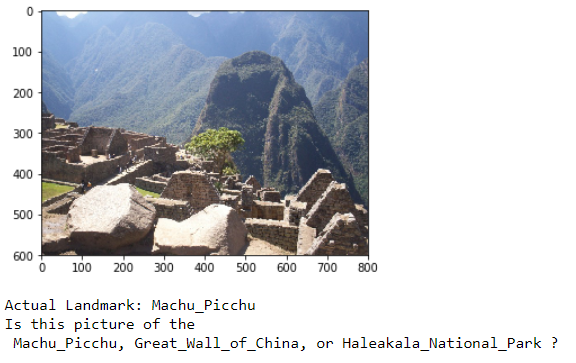
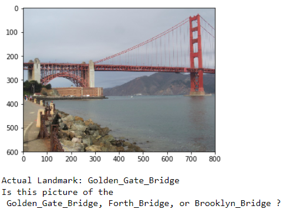
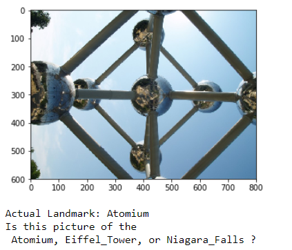

# Landmark Classification & Tagging for Social Media
### Udacity Deep Learning Nanodegree Project.

### Table of Contents

1. [Description](#description)
2. [Installation](#installation)
3. [Files](#files)
4. [License](#license)
5. [Screenshots](#screenshots)


## Description<a name="description"></a>

In this project, I trained a deep learning model using Pytorch to detect and classify landmarks.
Basically, I have:

1) Create a CNN to Classify Landmarks (from Scratch)
2) Create a CNN to Classify Landmarks (using Transfer Learning)
3) Write a Landmark Prediction Algorithm

## Installation <a name="installation"></a>

This code runs with Python version 3.* and requires some additional library, to install this library you will need to execute:
```bash
pip install opencv-python
pip install matplotlib
pip install numpy
pip install Pillow
pip install torch
pip install torchvision

```
Please note that GPU is being used to train and run the code. 


## Files<a name="files"></a>

The `landmark.ipynb` notebook available here contained all the codes.  

The landmark images used for this project are a subset of the Google Landmarks Dataset v2. The dataset used for this project is quite large and can be downloaded by following this [link](https://udacity-dlnfd.s3-us-west-1.amazonaws.com/datasets/landmark_images.zip).
Unzip the folder and place it in this project's home directory, at the location /images:

You can find license information for the full dataset on [Kaggle](https://www.kaggle.com/google/google-landmarks-dataset).


## License<a name="license"></a>
[](https://opensource.org/licenses/MIT)


## Screenshots<a name="screenshots"></a>
1. This is an example of testing the Deep Learning model to predict the top 3 most likely landmarks






